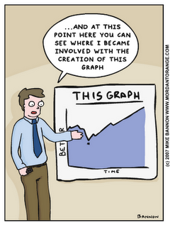

# Welcome to the BDS Toolbox module: Data Visualization!

## 📍 Homepage
[Data Visualization 2025](https://ann1ejohansson.github.io/data-visualization-2025)

## 🔗 Quick links

📝 [Assignment 1](https://ann1ejohansson.github.io/data-visualization-2025/assignments/assignment-1.html)

📝 [Assignment 2](https://ann1ejohansson.github.io/data-visualization-2025/assignments/assignment-2.html)

📺 [Slides](https://ann1ejohansson.github.io/data-visualization-2025/slides/slides.html#/title-slide)

ℹ️ [Working on the Oefenweb Server](https://ann1ejohansson.github.io/data-visualization-2025/documents/working-on-the-server.html)

ℹ️ [Git Workflow - Tutorial](https://ann1ejohansson.github.io/data-visualization-2025/documents/git-workflow.html)

ℹ️ [Rubrics](https://ann1ejohansson.github.io/data-visualization-2025/documents/how-do-we-grade.html)

📚 [Data Visualization: A practical introduction (Healy)](https://socviz.co/)

📚 [R for Data Science - Data visualization chapter](https://r4ds.hadley.nz/data-visualize.html)

📚 [Videos on canvas](https://canvas.uva.nl/courses/54361/modules)

